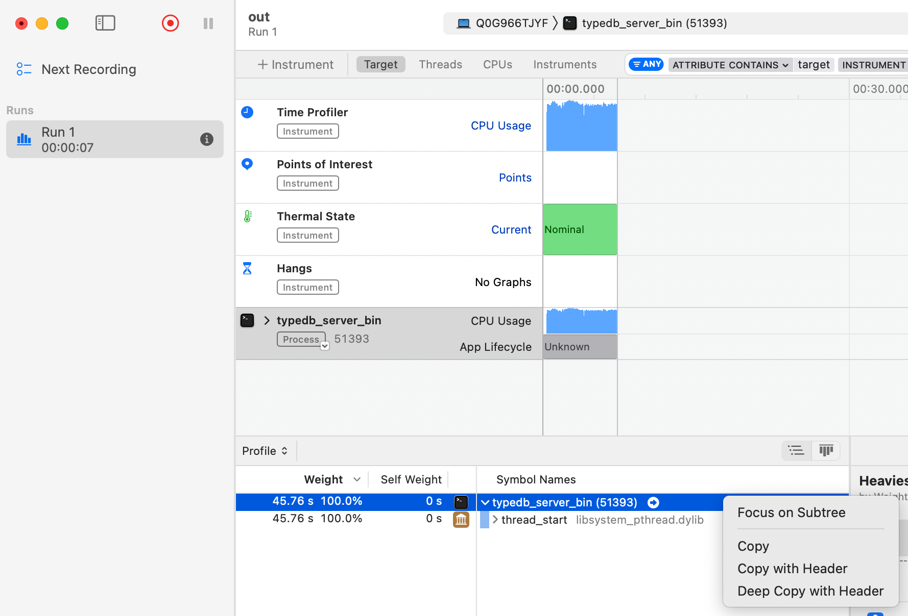

# Profiling with flamegraphs

First, run `git submodule update --init --recursive` to initialize and update the FlameGraph submodule.

## On MacOS

### Using `xctrace`

Xctrace is a new native way of profiling on MacOS.

#### Requirements and setup

You need MacOS `>= 14.5`.

1. Install `Xcode` from App Store
2. Try to run `xctrace list template` to see a list of profiling templates
  1. If this fails with a message about command line tools being incorrectly selected, you may have to switch them:  `sudo xcode-select --switch /Applications/Xcode.app/Contents/Developer`
  2. Try to run `xcode-select -p` to see whether the change took effect
  3. Maybe run `sudo xcodebuild -license` if you still need to accept the licence (it'll tell you)

#### Running and profiling

Add a profiling profile in your Cargo.toml:
```
[profile.profiling]
inherits = "release"
debug = true
```

Run your binary
```
cargo run --package typedb_server_bin --bin typedb_server_bin --profile profiling
```
and start the workload you want to profile. 

Start the profiler (writing output to `out.trace` in the present folder)
```
xctrace record --template 'Time Profiler' --output out.trace --attach "typedb_server_bin"
```
and stop it with `Ctrl+C` whenever you wish (second range is probably appropriate, it collects ~1000 samples per second).

#### Extracting a flamegraph

Open `out.trace` with the Instruments App (installed as part of Xcode). In the App, make a `Deep Copy with Header` of the stack trace as shown below.



Write the copied data to a file, say `out.txt`. 

Collapse the file using the `stackcollapse-instruments` script as follows.
```
FlameGraph/stackcollapse-instruments.pl out.txt > trace.folded
```

Finally, generate the flame graph using the `flamegraph` script:
```
FlameGraph/flamegraph.pl trace.folded > trace.svg
```

Open tne `.svg` file in a browser (it can be navigated!).

### Using `sample`

Sample is an older way of profiling on MacOS (~2017).

#### Origin

Inspiration taken from:

https://stackoverflow.com/questions/23200704/install-perf-on-mac

#### Requirements and setup

For running on Mac (these may already be installed/come with xcode developer tools!)
- `sample`
- `filtercalltree`
- `perl`

Other OS's are not supported.


#### Set of commands combined:

Automated usage:

```
./sample_flamegraph_mac.sh <pid> <sampling duration seconds>
```

This will produce a flamegraph for process <pid> sampled over the indicated duration. The flamegraph location will be printed afterward.

On mac, the simplest way to open these is with `open <path to .svg>`.

Manual example that the script automates:
```
sample <pid> -f output.prof <duration seconds> <sample interval in seconds> 
filtercalltree output.prof  > filtered.prof
./stackcollapse-sample.awk filtered.prof > out.folded
./FlameGraph/flamegraph.pl out.folded > flamegraph.svg
```

## On Linux

### Using `perf`

(User space profiling)

### Using `eBPF`

(Kernel space profiling)